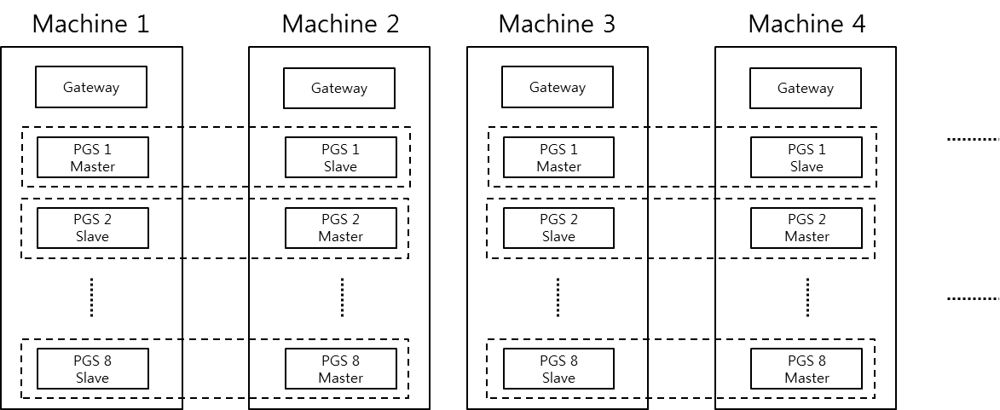

# Overview
* [Components](#components)
  * [Components for Management](#components-for-management)
  * [Components for Data](#components-for-data)
* [Setup](#setup)
* [Terminologies](#terminologies)

##	Components
The components of nbase-arc are subdivided into two types: those for management which include ZooKeeper 
and Configuration Master, and those for data which include Redis, State Machine Replicator (SMR) and gateway.

### Components for Management
To use nbase-arc, you should install the components for management, ZooKeeper and Configuration Master, 
and build an nbase-arc zone, which is used to create an nbase-arc cluster. Once a zone is built, 
you can create and use multiple clusters on it without creating additional zones.

### Components for Data
You can use management functions of nbase-arc zone to create an nbase-arc cluster. 
While the nbase-arc cluster is perceived as a single Redis to users, 
it actually consists of multiple Redis, SMR and gateway processes. 

##### REDIS process
Uses a modified version of Redis 2.8.8. The actual data is stored here.

##### SMR process
A process in charge of replication. A Redis process makes a pair with an SMR process. Each Redis process should be run with its pair SMR process because nbase-arc does not use Redis replication but uses SMR to process replication.

##### Gateway process
A process that handles distribution rules. It delivers the client's command to a Redis process conforming to the rules, and returns the execution result to the client.

## Setup
Build an nbase-arc zone and then create an nbase-arc cluster on it.
You should install management components on at least 3 machines to make Zookeeper ensemble work, and data components on more than 2 machines for replication.
You should manually install the nbase-arc zone at first, while the nbase-arc cluster is automatically installed by using the zone's management function. 

## Terminologies

##### Cluster
A logical unit that consists of multiple Redis processes. A cluster is perceived as a single Redis to users, but it is actually composed of multiple Redis processes that are distributed in different machines.

##### Zone
A management unit that consists of multiple clusters. In general, an nbase-arc zone is built in a network, and multiple clusters are created in one zone.

##### PGS
PGS stands for partition group server. It is a pair of a Redis process and an SMR process.

##### PG
PG stands for partition group. It is a unit of distributed data store. The nbase-arc cluster consists of multiple PGs, by which data keys are grouped. You can say that sharded data is distributed and stored in each PG, similar to a database system.  
A PG consists of 2 ~ 5 PGSes and each PGS consists of a Redis process and an SMR process. Therefore, one PG consists of 2 ~ 5 Redis processes and SMR processes.  
The PGSes that belong to the same PG contain the same data, which means they are replicas to each other.  
In short, nbase-arc distributes and stores data in a PG, a logical unit of distributed data store, which actually consists of several PGSes. The PGSes in the same PG are replicas that contain the same data for system availability.

##### Management node
A machine where the components for management are installed. Required to build an nbase-arc zone.

##### Data node
A machine where the components for data are installed. Used by nbase-arc clusters in the zone.
